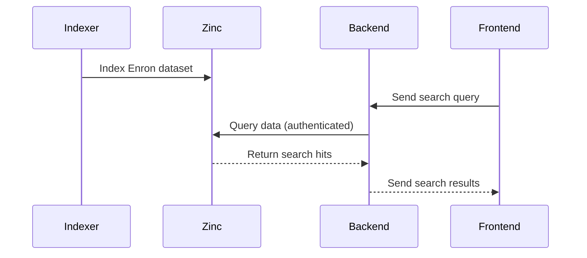

# Enron Email Viewer

## Overview
The Enron Email Viewer is a comprehensive full-stack application designed to index and search through the Enron email dataset using ZincSearch. It's composed of several key components:

1. **ZincSearch**: A search engine used to index and query emails.
2. **Indexer**: A custom Go application that processes and indexes the Enron email dataset into ZincSearch.
3. **Backend**: A Go-based API server using the Chi routing package, which provides search capabilities to the frontend.
4. **Web Client**: A Vue.js front-end that allows users to search and view emails interactively.

## Architecture
This project leverages Docker and Docker Compose to orchestrate multiple services:

- `zinc`: Runs the ZincSearch server.
- `indexer`: Processes and indexes the Enron dataset.
- `backend`: Serves the backend API.
- `web-client`: Provides the user interface.

## Prerequisites
- Docker
- Docker Compose

## Setup and Running

### Clone the Repository
Start by cloning the repository to your local machine:

```bash
git clone git@github.com:xaguzman/enron-email-viewer.git
cd enron-email-viewer
```

### Start the Services
Use Docker Compose to start all the components:

```bash
docker-compose up --build
```

This command builds and starts all services. Here are the endpoints once services are up:
- **Frontend**: [http://localhost:8080](http://localhost:8080)
- **Backend API**: [http://localhost:3000](http://localhost:3000)
- **ZincSearch Admin UI**: [http://localhost:4080](http://localhost:4080)

### System Communication Flow



## Stopping the Application
To stop and remove all containers, use:

```bash
docker-compose down
```

## Additional Notes
- Adjust environment variables as necessary, particularly those related to authentication and API endpoints.
